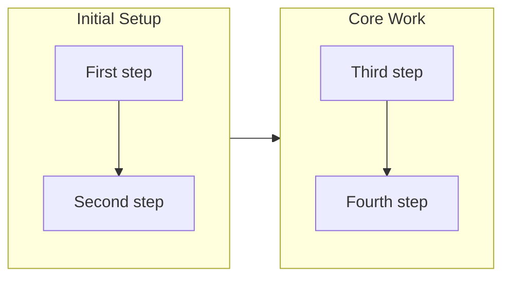

# Write Story orchestration — phase detail

The `/report` command (main agent) runs these phases directly: it executes the bash/Read/Write steps inline and spawns each leaf worker as a parallel worker Task whose prompt names the skill to preload, the section to run, the inputs, and the return schema. There is no intermediate story-writer subagent — all fan-out stays one level deep (a subagent cannot spawn further subagents).

## Phase 0: Gather Context

```bash
bash ../gather/scripts/git-context.sh
```

Returns: branch, base_branch, repo_url, archived_tickets, git_log.

Before the phases, bump the version following CLAUDE.md's Version Management section (patch increment) — skip when `bash ../branching/scripts/check-version-bump.sh` reports `already_bumped: true`.

The script measures against the resolved base (`gather/scripts/base-ref.sh`, i.e. `origin/<default>` as last fetched) and reports it in `base`; it does not fetch, so freshness stays the caller's act — on the drive path `sync-main.sh` has already fetched and the claim worktree is cut from that tip. A read whose base could not be resolved comes back `ok: false` with a named `reason` (`base_never_fetched`, `no_base_ref`, `base_not_found`, `base_unresolved`) and `already_bumped: false`: **bump, and report the reason**. Skipping on an unresolvable base is the failure this contract exists to prevent — it ships plugin changes on a stale version, silently.

## Phase 1: Judge Open Deferred Concerns

Run before the parallel batch. Skip silently when `list-open-concerns.sh` reports zero open concerns.

1. Spawn a deferred-concern judge as parallel worker in a single Task call: preload `report`, follow `### Judge Deferred Concerns` (and its [reference/judge-deferred-concerns.md](judge-deferred-concerns.md)) with the branch name and base branch, return `{verdicts: [...]}`.
2. Establish one private per-run artifact directory for this `/report` and reuse it for every intermediate file — `RUN_DIR=$(mktemp -d)`. Never park artifacts at a constant `/tmp/...` path: concurrent `/report`s across desks would share it, and a stale or foreign payload left there is read silently instead of loudly.
3. Write the judge's JSON to `$RUN_DIR/deferred-concern-verdicts.json` (the full `{"verdicts": [...]}` object or a bare array both work; prefer the object verbatim), then apply, passing the expected concern count — the number of open concerns `list-open-concerns.sh` returned — as the first argument so a stale/foreign `{"verdicts": []}` fails loud (non-zero exit) instead of silently reporting `still_active: 0`:

   ```bash
   cat "$RUN_DIR/deferred-concern-verdicts.json" | bash ../report/scripts/apply-deferred-concern-verdicts.sh "$EXPECTED_CONCERN_COUNT"
   ```

   Each `resolved` verdict appends a superseding feedback record to the stream (`kind: concern`, `supersedes: <record filename>`, `resolved_by_pr`/`resolved_by_commit` recorded) — the resolved record itself is immutable, never edited or moved; `list-open-concerns.sh` excludes it from the open set from then on. `still_active` verdicts write nothing.

## Phase 2: Spawn Story Generation Workers

**Scale to the branch's size first** (right-sizing to single-ticket-per-PR granularity, FB `20260809010511`): count Phase 0's `archived_tickets`. The loop now merges a PR per single ticket far more often than a whole Story's worth, so the fixed 3-subagent fan-out below — sized for a Story-sized batch — is disproportionate to the common case. Two paths, chosen once per run and reported which was taken:

- **Lite path — `archived_tickets` count ≤ 2** (the common case: one backlog ticket, or a small mission batch like this one). Spawn **one** `general-purpose` leaf subagent that folds all three roles into a single pass: preload `report` and run `## Assess Release Readiness`; preload `review-sections` and run it; and produce Overview/Highlights/Motivation per [Overview Generation detail](#overview-generation-detail) fields 1-3 **only** — field 4 (Journey) is skipped outright, never generated and never rendered. Pass it every input the three roles below individually receive. It returns one merged JSON: `{releasability: {...}, overview: {overview, highlights[], motivation}, review: {historical_context, outcome, concerns, development_patterns}}` — same field shapes as the full path, minus `journey`. A flowchart earns its keep only once there is a multi-phase progression worth diagramming; the Changes section goes straight from the ticket-count line to the per-ticket subsections (story-structure.md's Changes guidelines).
- **Full path — `archived_tickets` count > 2** (a Story-shaped batch). Unchanged: spawn 3 `general-purpose` leaf subagents in parallel (single message, 3 Task calls):

  - **release-readiness**: preload `report`, run `## Assess Release Readiness`, return the releasability JSON. Pass archived tickets list and branch name.
  - **overview-writer**: preload `report`, run `### Overview Generation`, return the overview JSON (including `journey`). Pass branch name and base branch.
  - **section-reviewer**: preload `review-sections`, run it, return its JSON (`historical_context`, `outcome`, `concerns`, `development_patterns`). Pass branch name, archived tickets list, the per-run verdicts file path `$RUN_DIR/deferred-concern-verdicts.json`, and the collected commit bodies (`collect-commits.sh` output). `historical_context` is not a section — it folds into Motivation, and it is empty far more often than not. The Concerns section records this branch's concerns only — open stream concerns are not prepended; the stream itself is the durable memory. The section-reviewer folds in `Concerns:` and `Insights:` keys from the commit bodies so content recorded at commit time is not lost when a ticket is sparse or absent.

Wait for the spawn(s) of whichever path ran; track which role(s) succeeded and which failed. **Phase 3 and everything after are identical between paths** — the result record (per-ticket Changes, Final Report content) and the cross-document relations (frontmatter `tickets:`/`mission:`, the stories index, the PR body links) are Phase 3/4/5 output, untouched by which path generated the narrative inputs.

## Phase 3: Write Story File

1. Read archived tickets (Glob `.workaholic/tickets/archive/<branch-name>/*.md`); extract frontmatter (`mission`) and content (Overview, Final Report). The change category comes from each commit's `Category:` git trailer via `collect-commits.sh` — the ticket `category` field is retired; an archived ticket still carrying one is history, not a source. Record each ticket's filename (the `tickets:` relation) and its `mission:` slugs (a list; a bare scalar counts as one), whose union is the story's `mission:`.
2. Take each ticket's commit hash from git, never from frontmatter:

   ```bash
   bash ../report/scripts/ticket-commits.sh <branch-name>
   ```

   Returns `[{"ticket": "<basename>.md", "commit": "<short-hash>"}]` — the commit that *added* each archived ticket, i.e. the commit that implemented it. Use those hashes for the Changes section's links. **Never read a ticket's `commit_hash` frontmatter**: a commit cannot carry its own hash, so old archive stamps are pre-amend hashes that were never pushed, and every link built from one 404s. A ticket whose `commit` comes back empty is not committed yet — surface that rather than dropping the ticket.
3. Write the story per the [story structure](story-structure.md), including the frontmatter relations.
4. Nothing to do for the stories index — it is generated. The story's `description:` frontmatter (step 3) is the entry, and `refresh-index.sh` at the knowledge-commit seam writes it. Never edit `.workaholic/stories/index.md` by hand (see the story structure reference).

## Phase 4: Commit and Push Story

1. Roll every related mission (skip when the story's `mission:` is empty). Once per slug — a branch advancing two missions rolls both — through the shared, idempotent mutators, never by hand-editing `mission.md`:
   - `bash ../mission/scripts/append-changelog.sh <mission-slug> "story reported" <branch-name>.md`
   - for each ticket filename in the story's `tickets:` list: `bash ../mission/scripts/tick-acceptance.sh <mission-slug> <ticket-filename>` (drive's `archive.sh` already ticks per ticket; this is an idempotent catch-up for tickets archived outside the mission-aware path).

   No de-duplication is needed: both mutators are keyed and idempotent, and `tick-acceptance.sh` finds nothing on a mission whose Acceptance does not list that ticket. Resolved concerns from Phase 1 already recorded their changelog line via `apply-deferred-concern-verdicts.sh`.
2. Refresh the OKF bundle indexes (stages them): `bash ../okf/scripts/refresh-index.sh`
3. Stage: `git add .workaholic/stories/ .workaholic/concerns/ .workaholic/missions/`
4. Commit: `git commit -m "Add branch story for <branch-name>"` (one commit captures the story, any concern records, mission updates, and refreshed indexes)
5. Push: `git push -u origin <branch-name>`

## Phase 5: Create PR

Spawn parallel worker preloading `report` and running `## Create PR`. Capture the `PR created/updated: <URL>` line.

Then display the full story file content inline for the developer, and the PR URL (mandatory). Release notes are not generated here — `write-release-note` runs at ship time in the `ship` flow.

## Worker Output Mapping

| Worker role | Sections | Fields |
| ----------- | -------- | ------ |
| overview-writer (full path only) | Overview, Motivation, Changes (journey preamble) | `overview`, `highlights[]`, `motivation`, `journey.mermaid`, `journey.summary` |
| section-reviewer | Motivation (past-context paragraph), Outcome, Concerns, Successful Development Patterns | `historical_context`, `outcome`, `concerns`, `development_patterns` |
| release-readiness | Release Preparation | `verdict`, `concerns[]`, `instructions.pre_release[]`, `instructions.post_release[]` |

On the **lite path** the single combined worker fills every row above except the journey fields, which it does not produce at all — the Changes section then opens directly on the per-ticket subsections, no mermaid fence.

The Changes section comes from archived tickets, prefaced by journey content from the overview-writer when the full path ran. Motivation has two contributors: the overview prose (`overview`-role or the combined worker) plus — appended only when non-empty — the section-reviewer's (or combined worker's) `historical_context`.

## Report Output Schema

```json
{
  "story_file": ".workaholic/stories/<branch-name>.md",
  "pr_url": "<PR-URL>",
  "workers": {
    "overview_writer": { "status": "success" | "failed", "error": "..." },
    "section_reviewer": { "status": "success" | "failed", "error": "..." },
    "release_readiness": { "status": "success" | "failed", "error": "..." },
    "pr_creator": { "status": "success" | "failed", "error": "..." }
  }
}
```

## Overview Generation detail

Generate the four fields consumed by story sections 1-3 by analyzing commit history. Run by the full path's dedicated overview-writer worker, and by the lite path's combined worker for fields 1-3 only (field 4, Journey, is full-path only — see Phase 2).

Collect commits:

```bash
bash ../report/scripts/collect-commits.sh [base-branch]
```

With no argument the base is resolved by `gather/base-ref.sh`, which prefers `origin/<default>` — the story is measured against what the PR is diffed against, immune to a stale local `main`; an unresolvable base fails loudly. Output:

```json
{
  "commits": [
    {
      "hash": "abc1234",
      "subject": "Add feature X",
      "body": "Detailed description of the change...",
      "timestamp": "2026-01-15T10:30:00+09:00",
      "category": "Added"
    }
  ],
  "count": 15,
  "base_branch": "main"
}
```

`body` carries the full structured commit message (`Why:` / `Changes:` / `Concerns:` / `Insights:` / `Verify:`): `Why` informs Motivation, `Changes` the highlights/journey. `category` is parsed from the commit's `Category:` git trailer (`Added`/`Changed`/`Removed`, or empty) — a log-native grouping key that survives even if the ticket is pruned.

The four fields:

1. **Overview** — 2-3 sentence summary of the branch essence (goal, approach, achievement). Past tense; synthesized from commit subjects.
2. **Highlights** — 3-5 meaningful changes: grouped from related commits, user-visible or architecturally significant, ordered by importance. One line each — the rendered Overview section is budgeted at 12 lines and the highlights are most of it.
3. **Motivation** — one paragraph synthesizing the "why": problem/opportunity, approach, constraints. Narrative prose. One paragraph means 9 lines (12 when the section-reviewer supplies a past-context paragraph).
4. **Journey** — `mermaid` (a flowchart of work progression) plus `summary` (50-100 words).

Flowchart rules:



- `flowchart LR` for the horizontal timeline; `direction TB` inside each subgraph
- Group by theme (one subgraph per concern area); connect subgraphs in timeline order
- Maximum 3-5 subgraphs, and 16 lines for the whole fence
- Descriptive node labels: `id[Description]`

Return JSON:

```json
{
  "overview": "2-3 sentence summary capturing the branch essence",
  "highlights": ["First meaningful change", "Second meaningful change", "Third meaningful change"],
  "motivation": "Paragraph synthesizing the 'why' from commit context",
  "journey": {
    "mermaid": "flowchart LR\n  subgraph Phase1[Initial Work]\n    direction TB\n    a1[Step 1] --> a2[Step 2]\n  end\n  ...",
    "summary": "50-100 word summary of the development journey"
  }
}
```
