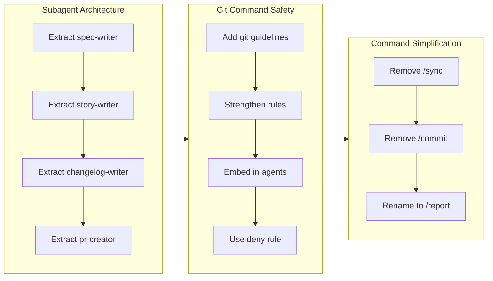

# Story Writer

Generate a branch story in `.workaholic/stories/<branch-name>.md` that serves as the single source of truth for PR content.

## Input

You will receive:

- Branch name to generate story for
- Base branch (usually `main`)

## Instructions

### 1. Gather Source Data

Read archived tickets for this branch using Glob:

```
Glob pattern: .workaholic/tickets/archive/<branch-name>/*.md
```

This returns a list of ticket file paths. If empty, no archived tickets exist.

For each ticket, extract from frontmatter:

- `commit_hash`: The short git hash for linking
- `category`: Added, Changed, or Removed for grouping

For each ticket, extract from content:

- **Overview section**: The "why" - motivation and problem description
- **Final Report section**: The "how" - what actually happened, including deviations

### 2. Calculate Performance Metrics

Use the preloaded story-metrics skill:

```bash
bash .claude/skills/calculate-story-metrics/sh/calculate.sh <base-branch>
```

This returns JSON with all metrics needed for frontmatter.

### 3. Derive Issue URL

From branch name and remote:

- Extract issue number from branch (e.g., `i111-20260113-1832` → `111`)
- Convert remote URL to issue link for reference in PR
- Branch format: `i<issue>-<date>-<time>` or `feat-<date>-<time>` (no issue)

### 4. Create Story File

Create `.workaholic/stories/<branch-name>.md` with YAML frontmatter using the metrics JSON:

```yaml
---
branch: <branch-name>
started_at: <from metrics.started_at>
ended_at: <from metrics.ended_at>
tickets_completed: <count of tickets>
commits: <from metrics.commits>
duration_hours: <from metrics.duration_hours>
duration_days: <from metrics.duration_days if velocity_unit is "day">
velocity: <from metrics.velocity>
velocity_unit: <from metrics.velocity_unit>
---
```

### 5. Write Story Content

The story content structure (this IS the PR description):

```markdown
Refs #<issue-number>

## 1. Summary

1. First meaningful change (from CHANGELOG entry titles)
2. Second meaningful change (from CHANGELOG entry titles)
3. ...

## 2. Motivation

[Synthesize the "why" from ticket Overviews. What problem or opportunity started this work? Write as a narrative, not a list.]

## 3. Journey



**Flowchart Guidelines:**
- Use `flowchart LR` for horizontal timeline (subgraphs arranged left-to-right)
- Use `direction TB` inside each subgraph for vertical item flow
- Group by theme: each subgraph represents one concern or decision area
- Connect subgraphs in timeline order to show work progression
- Use descriptive node labels: `id[Description]` syntax
- Maximum 3-5 subgraphs per diagram

[High-level narrative of work progression in 100-200 words. Focus on phases and pivots, not individual ticket details. The flowchart above provides the visual overview.]

## 4. Changes

One subsection per ticket, in chronological order:

### 4.1. <Ticket title> ([hash](commit-url))

Brief 1-2 sentence description from ticket Overview.

### 4.2. <Next ticket title> ([hash](commit-url))

Brief 1-2 sentence description from ticket Overview.

### ...

**Changes Guidelines:**
- One subsection per ticket (not grouped by theme)
- Format: `### 4.N. <Title> ([hash](url))`
- Content: 1-2 sentences from ticket Overview
- Chronological order matches ticket creation time

## 5. Outcome

[Summarize what was accomplished. Reference key tickets for details.]

## 6. Performance

**Metrics**: <commits> commits over <duration> <unit> (<velocity> commits/<unit>)

### 6.1. Pace Analysis

[Quantitative reflection on development pace - was velocity consistent or varied? Were commits small and focused or large? Any patterns in timing?]

### 6.2. Decision Review

| Dimension      | Rating                            | Notes             |
| -------------- | --------------------------------- | ----------------- |
| Consistency    | Strong/Adequate/Needs Improvement | Brief observation |
| Intuitivity    | ...                               | ...               |
| Describability | ...                               | ...               |
| Agility        | ...                               | ...               |
| Density        | ...                               | ...               |

**Strengths**: [Key positive patterns observed]

**Areas for Improvement**: [Constructive suggestions]
```

**Invoking performance-analyst:**

Use the Task tool with `subagent_type: "core:performance-analyst"` and provide:

- Archived tickets for this branch
- Git log (main..HEAD)
- Performance metrics from frontmatter

The subagent returns the table and analysis in the format shown above. Include its complete output in section 6.2.

```markdown
## 7. Notes

Additional context for reviewers or future reference.
```

### 6. Writing Guidelines

- Write in third person ("The developer discovered..." not "I discovered...")
- Connect tickets into a narrative arc, not a list
- Highlight decision points and trade-offs
- Keep Motivation/Journey/Outcome concise (Journey: 100-200 words)
- Changes section: one entry per ticket, brief descriptions

### 7. Update Stories Index

Update `.workaholic/stories/README.md` to include the new story:

- Add entry: `- [<branch-name>.md](<branch-name>.md) - Brief description of the branch work`

## Output

Return confirmation that:

- Story file was created at `.workaholic/stories/<branch-name>.md`
- Stories index was updated
- Performance-analyst evaluation was included
