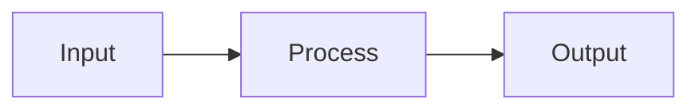
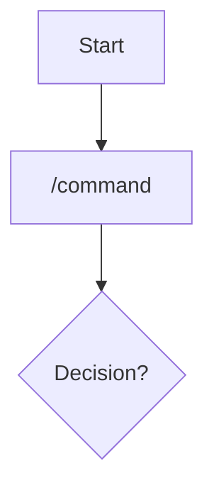
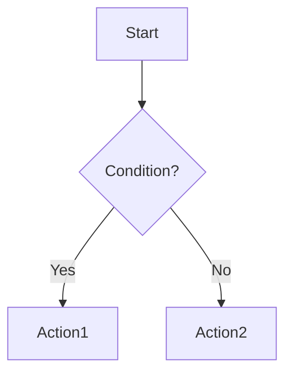
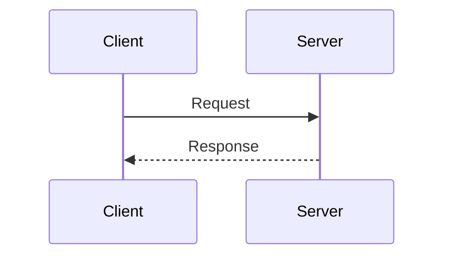
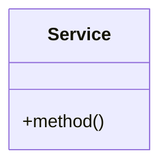

---
paths:
  - '**/*.md'
---

# Diagrams

**Use Mermaid, not ASCII art** for all diagrams in documentation and code comments.

## Why Mermaid

- Renders natively in GitHub, VS Code, and most documentation systems
- Version-controllable and diffable
- Consistent rendering across platforms
- Interactive (zoomable, clickable in some renderers)

## Prohibited

- Box-drawing characters (`+--+`, `|`, `└──`)
- ASCII arrow combinations (`-->`, `==>`, `->`)
- Manual alignment with spaces for visual structure

## Required Format

Use fenced code blocks with `mermaid` language:

````markdown

````

## Node Labels (REQUIRED)

**MUST quote labels** containing special characters (`/`, `{`, `}`, `[`, `]`):



**Why**: Unquoted `/` causes GitHub to fail with `Lexical error on line N. Unrecognized text.`

Common violations:
- `A[/story command]` ❌ → `A["/story command"]` ✓
- `B[path/to/file]` ❌ → `B["path/to/file"]` ✓

## Common Diagram Types

**Flowchart** for process flows:



**Sequence** for interactions:



**Class** for architecture:



## Exceptions

- Simple inline arrows in code comments (`// A -> B`) are acceptable for quick explanations
- Complex diagrams requiring external tools (e.g., network topologies) should link to external images
