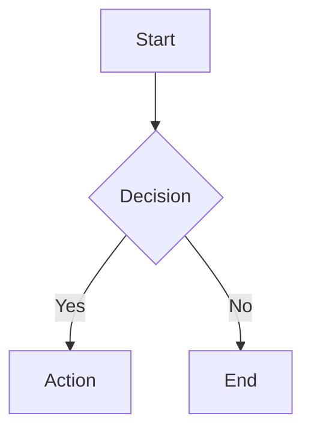

# Documentation Standards

## File Format

Every markdown file must have YAML frontmatter:

```yaml
---
title: Document Title
description: Brief description of this document
category: user | developer
last_updated: YYYY-MM-DD
---
```

## Structure

- `doc/README.md` - Index linking to specs/ and tickets/
- `doc/specs/README.md` - Index for all specifications
- `doc/specs/user-guide/README.md` - Index for user documentation
- `doc/specs/developer-guide/README.md` - Index for developer documentation
- `doc/tickets/README.md` - Index for ticket system

**Requirement**: Every subdirectory under `doc/specs/` must have a README.md that links to all documents in that directory.

## Heading Levels

- H1 (`#`): Document title only (one per file, matches frontmatter title)
- H2 (`##`): Major sections
- H3 (`###`): Subsections
- H4 (`####`): Rarely used, only for deep nesting

## Markdown Style

- Use Mermaid charts for diagrams (flowcharts, sequences, architecture)
- Write full paragraphs, not bullet-point fragments
- Code blocks must specify language
- Links use relative paths within doc/
- Tables for structured data comparisons

## Mermaid Usage



## Link Hierarchy

```
README.md (root)
└── doc/README.md
    ├── doc/specs/README.md
    │   ├── doc/specs/user-guide/README.md
    │   │   └── (individual user docs)
    │   └── doc/specs/developer-guide/README.md
    │       └── (individual developer docs)
    └── doc/tickets/README.md
```

## Subdirectory README Format

Each subdirectory README must:

- Have YAML frontmatter with title and description
- List all documents in the directory with brief descriptions
- Use relative links to documents

Example:

```yaml
---
title: User Documentation
description: Documentation for end users of the project
category: user
last_updated: 2026-01-23
---
```

```markdown
# User Documentation

- [Getting Started](GETTING_STARTED.md) - Installation and first steps
- [Commands](COMMANDS.md) - Complete command reference
```

## Constraints

- No orphan documents (must be linked from parent)
- Every subdirectory in `doc/specs/` must have a README.md
- Follow written language specified in CLAUDE.md
- Update relevant docs with every code change
- Keep docs close to what they document
