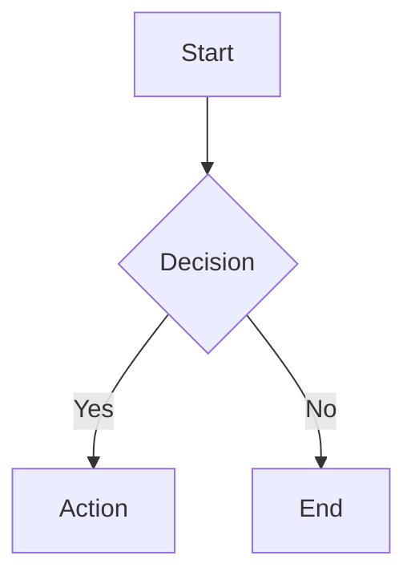

# Documentation Standards

## File Format

Every markdown file must have YAML frontmatter:

```yaml
---
title: Document Title
description: Brief description of this document
category: user | developer
last_updated: YYYY-MM-DD
---
```

## Structure

- `doc/README.md` - Index linking to specs/ and tickets/
- `doc/specs/README.md` - Index for all specifications
- `doc/specs/for-user/` - User-facing documentation
- `doc/specs/for-developer/` - Technical documentation
- `doc/tickets/README.md` - Index for ticket system

## Heading Levels

- H1 (`#`): Document title only (one per file, matches frontmatter title)
- H2 (`##`): Major sections
- H3 (`###`): Subsections
- H4 (`####`): Rarely used, only for deep nesting

## Markdown Style

- Use Mermaid charts for diagrams (flowcharts, sequences, architecture)
- Write full paragraphs, not bullet-point fragments
- Code blocks must specify language
- Links use relative paths within doc/
- Tables for structured data comparisons

## Mermaid Usage



## Link Hierarchy

README.md (root)
└── doc/README.md
    ├── doc/specs/README.md
    │   ├── doc/specs/for-user/
    │   └── doc/specs/for-developer/
    └── doc/tickets/README.md

## Constraints

- No orphan documents (must be linked from parent)
- Follow written language specified in CLAUDE.md
- Update relevant docs with every code change
- Keep docs close to what they document
