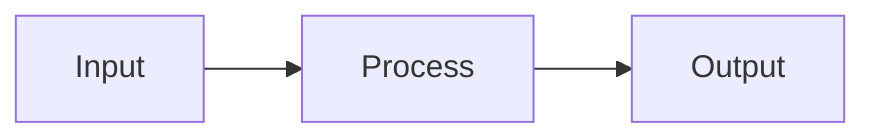
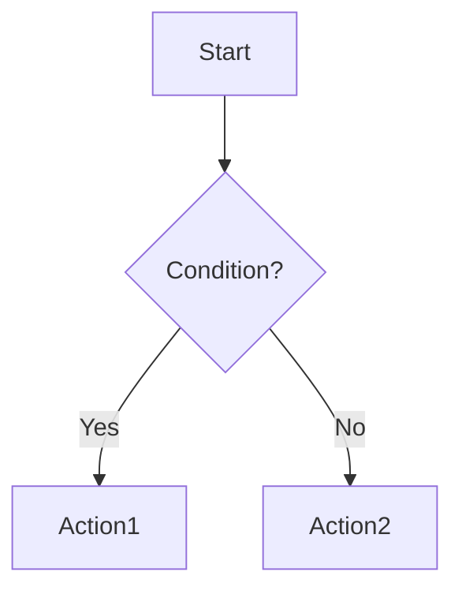
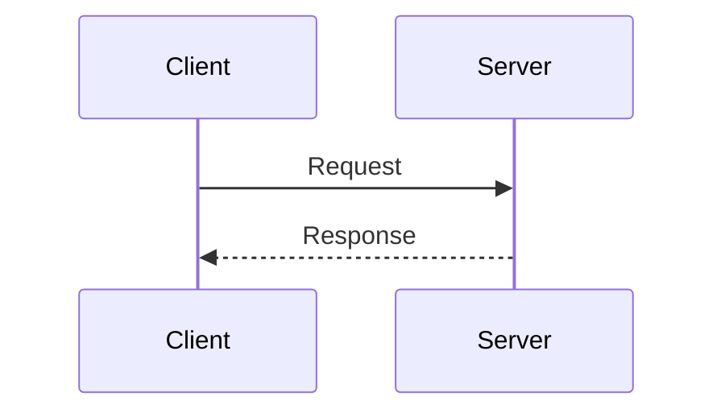
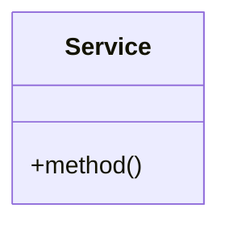

# General Rules

- **Never commit without permission** - Always ask for confirmation before creating any git commit
- **Never use `git -C`** - Run git commands from the working directory, not with `-C` flag

## Multi-Language Documentation

When a project needs documentation in multiple languages:

### File Structure

**Root-level READMEs (suffix-based):**

```
README.md           # Primary language (as specified in CLAUDE.md)
README_ja.md        # Japanese translation
README_zh.md        # Chinese translation
README_ko.md        # Korean translation
```

**Documentation directories (folder-based):**

```
docs/
  en/               # English (or primary language)
    README.md
    getting-started.md
  ja/               # Japanese
    README.md
    getting-started.md
```

### Policy

1. **Primary README stays as `README.md`** - GitHub only displays `README.md` on the repository landing page

2. **Use underscore separator for root files** - Use `README_<lang>.md` format (e.g., `README_ja.md`)

3. **Use ISO 639-1 language codes** - Standard two-letter codes: `ja`, `zh`, `ko`, `es`, `fr`, `de`, etc.

4. **Add language navigation badges** at the top of each README:

   ```markdown
   [English](README.md) | [日本語](README_ja.md) | [中文](README_zh.md)
   ```

5. **Use folder-based structure for large docs** - When >5 documentation files exist, organize by `docs/<lang>/`

6. **Keep translations in sync** - Note which translations need updating when primary docs change

7. **Respect CLAUDE.md language setting** - The specified language determines:
   - Which language `README.md` should be in
   - The primary language for commit messages and PRs
   - Translations are supplementary, not primary

## Diagrams

**Use Mermaid, not ASCII art** for all diagrams in documentation and code comments.

### Why Mermaid

- Renders natively in GitHub, VS Code, and most documentation systems
- Version-controllable and diffable
- Consistent rendering across platforms
- Interactive (zoomable, clickable in some renderers)

### Prohibited

- Box-drawing characters (`+--+`, `|`, `└──`)
- ASCII arrow combinations (`-->`, `==>`, `->`)
- Manual alignment with spaces for visual structure

### Required Format

Use fenced code blocks with `mermaid` language:

````markdown

````

### Common Diagram Types

**Flowchart** for process flows:


**Sequence** for interactions:


**Class** for architecture:


### Exceptions

- Simple inline arrows in code comments (`// A -> B`) are acceptable for quick explanations
- Complex diagrams requiring external tools (e.g., network topologies) should link to external images
