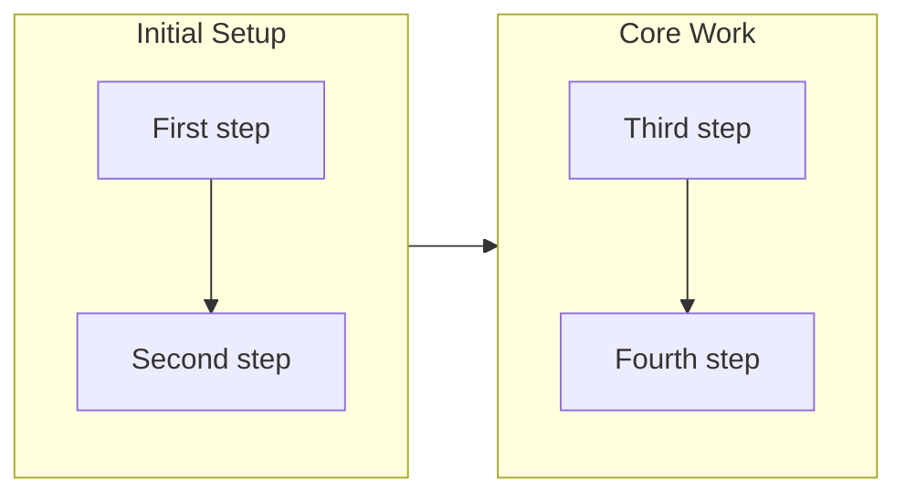

# Write Overview

Generate structured overview content by analyzing commit history for a branch.

## Collect Commits

Run the bundled script to collect commit information:

```bash
bash .claude/skills/write-overview/sh/collect-commits.sh [base-branch]
```

Default base branch is `main`.

### Output Format (JSON)

```json
{
  "commits": [
    {
      "hash": "abc1234",
      "subject": "Add feature X",
      "body": "Detailed description of the change...",
      "timestamp": "2026-01-15T10:30:00+09:00"
    }
  ],
  "count": 15,
  "base_branch": "main"
}
```

## Content Structure

Generate JSON with four components:

### 1. Overview

A 2-3 sentence summary capturing the branch essence:
- What was the main goal?
- What approach was taken?
- What was achieved?

Write in past tense. Synthesize from commit subjects.

### 2. Highlights

Array of 3-5 meaningful changes:
- Extract from commit subjects
- Group related commits into single highlights
- Focus on user-visible or architecturally significant changes
- Order by importance, not chronology

### 3. Motivation

A paragraph synthesizing the "why":
- What problem or opportunity started this work?
- Why was this approach chosen?
- What constraints or requirements shaped the work?

Write as narrative prose, not a list.

### 4. Journey

Two parts:
- **mermaid**: A flowchart showing work progression
- **summary**: 50-100 word summary of development journey

#### Flowchart Guidelines



- Use `flowchart LR` for horizontal timeline
- Use `direction TB` inside each subgraph for vertical flow
- Group by theme: each subgraph is one concern area
- Connect subgraphs in timeline order
- Maximum 3-5 subgraphs per diagram

## Output Format

Return JSON:

```json
{
  "overview": "2-3 sentence summary capturing the branch essence",
  "highlights": [
    "First meaningful change",
    "Second meaningful change",
    "Third meaningful change"
  ],
  "motivation": "Paragraph synthesizing the 'why' from commit context",
  "journey": {
    "mermaid": "flowchart LR\n  subgraph Phase1[Initial Work]\n    direction TB\n    a1[Step 1] --> a2[Step 2]\n  end\n  ...",
    "summary": "50-100 word summary of the development journey"
  }
}
```
