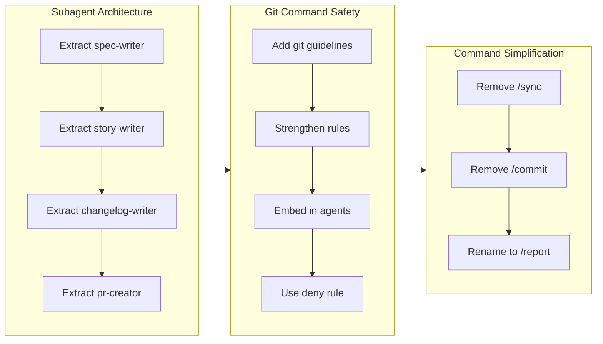

# Write Story

Generate a branch story that serves as the single source of truth for PR content.

## Agent Output Mapping

Story sections are populated from parallel agent outputs:

| Agent | Sections | Fields |
| ----- | -------- | ------ |
| overview-writer | 1, 2, 3 | `overview`, `highlights[]`, `motivation`, `journey.mermaid`, `journey.summary` |
| section-reviewer | 5, 6, 7, 8 | `outcome`, `historical_analysis`, `concerns`, `ideas` |
| performance-analyst | 9 | metrics JSON + decision review markdown |
| release-readiness | 10 | `verdict`, `concerns[]`, `instructions.pre_release[]`, `instructions.post_release[]` |
| release-note-writer | (separate file) | Writes to `.workaholic/release-notes/<branch>.md` |

Section 4 (Changes) comes from archived tickets. Section 11 (Notes) is optional context.

## Story Content Structure

The story content (this IS the PR description):

```markdown
## 1. Overview

[Content from overview-writer `overview` field: 2-3 sentence summary capturing the branch essence.]

**Highlights:**

1. [From overview-writer `highlights[0]}]
2. [From overview-writer `highlights[1]`]
3. [From overview-writer `highlights[2]`]

## 2. Motivation

[Content from overview-writer `motivation` field: paragraph synthesizing the "why" from commit context.]

## 3. Journey



**Flowchart Guidelines:**
- Use `flowchart LR` for horizontal timeline (subgraphs arranged left-to-right)
- Use `direction TB` inside each subgraph for vertical item flow
- Group by theme: each subgraph represents one concern or decision area
- Connect subgraphs in timeline order to show work progression
- Use descriptive node labels: `id[Description]` syntax
- Maximum 3-5 subgraphs per diagram

[Content from overview-writer `journey.mermaid` for the flowchart and `journey.summary` for this prose section.]

## 4. Changes

One subsection per ticket, in chronological order:

### 4-1. <Ticket title> ([hash](<repo-url>/commit/<hash>))

- First file changed with description of modification
- Second file changed with description of modification
- ...

### 4-2. <Next ticket title> ([hash](<repo-url>/commit/<hash>))

- First file changed with description of modification
- Second file changed with description of modification
- ...

### ...

**Changes Guidelines:**
- One subsection per ticket (not grouped by theme)
- **CRITICAL**: Commit hash MUST be a clickable GitHub link, not plain text
  - Wrong: `(abc1234)` or `(<hash>)`
  - Correct: `([abc1234](<repo-url>/commit/abc1234))`
- Format: `### 4-N. <Title> ([hash](<repo-url>/commit/<hash>))`
- **MUST list all files changed** as bullet points, not paragraph prose
- Reference ticket Implementation section or Changes section for the complete file list
- Chronological order matches ticket creation time

## 5. Outcome

[Summarize what was accomplished. Reference key tickets for details.]

## 6. Historical Analysis

[Context from related past work. What similar problems were solved before? What patterns emerge from the Related History sections of tickets? If no related tickets exist, write "No related historical context."]

## 7. Concerns

[Risks, trade-offs, or issues discovered during implementation. Each concern should include identifiable references.]

**Format**: `- <description> (see [hash](<repo-url>/commit/<hash>) in path/to/file.ext)`

**Example**:
- The pathspec exclusion syntax requires modern git versions (see [7eab801](<repo-url>/commit/7eab801) in `plugins/core/skills/drive-approval/SKILL.md`)
- Auto-approval configuration may be broader than intended (`~/.claude/settings.local.json`)

**Guidelines**:
- Reference the commit hash from section 4 where the concern was introduced
- Include the file path where readers should investigate
- Write "None" if nothing to report

## 8. Ideas

[Enhancement suggestions for future work. Improvements that were out of scope. "Nice to have" features identified during implementation. Write "None" if nothing to report.]

## 9. Performance

**Metrics**: <commits> commits over <duration> <unit> (<velocity> commits/<unit>)

### 9-1. Pace Analysis

[Quantitative reflection on development pace - was velocity consistent or varied? Were commits small and focused or large? Any patterns in timing?]

### 9-2. Decision Review

| Dimension      | Rating                            | Notes             |
| -------------- | --------------------------------- | ----------------- |
| Consistency    | Strong/Adequate/Needs Improvement | Brief observation |
| Intuitivity    | ...                               | ...               |
| Describability | ...                               | ...               |
| Agility        | ...                               | ...               |
| Density        | ...                               | ...               |

**Strengths**: [Key positive patterns observed]

**Areas for Improvement**: [Constructive suggestions]
```

**Performance-analyst input:**

The performance-analyst output (metrics JSON and decision review markdown) is provided by story-writer which invokes performance-analyst as a parallel agent. Include the complete output in section 9.

```markdown
## 10. Release Preparation

**Verdict**: [Ready for release / Needs attention before release]

### 10-1. Concerns

- [List any concerns from release-readiness analysis]
- Or "None - changes are safe for release"

### 10-2. Pre-release Instructions

- [Steps to take before running /release]
- Or "None - standard release process applies"

### 10-3. Post-release Instructions

- [Steps to take after release]
- Or "None - no special post-release actions needed"
```

**Release-readiness input:**

The release-readiness JSON is provided by story-writer which invokes release-readiness as a parallel agent. The JSON contains:

```json
{
  "releasable": true/false,
  "verdict": "Ready for release" / "Needs attention before release",
  "concerns": [],
  "instructions": {
    "pre_release": [],
    "post_release": []
  }
}
```

Format this JSON into section 10.

```markdown
## 11. Notes

Additional context for reviewers or future reference.
```

## Story Frontmatter

Create `.workaholic/stories/<branch-name>.md` with YAML frontmatter. Metrics values come from performance-analyst output:

```yaml
---
branch: <branch-name>
started_at: <from performance-analyst metrics>
ended_at: <from performance-analyst metrics>
tickets_completed: <count of tickets>
commits: <from performance-analyst metrics>
duration_hours: <from performance-analyst metrics>
duration_days: <from performance-analyst metrics if velocity_unit is "day">
velocity: <from performance-analyst metrics>
velocity_unit: <from performance-analyst metrics>
---
```

## Writing Guidelines

- Write in third person ("The developer discovered..." not "I discovered...")
- Connect tickets into a narrative arc, not a list
- Highlight decision points and trade-offs
- Keep Motivation/Journey/Outcome concise (Journey: 50-100 words)
- Changes section: one entry per ticket, brief descriptions
- Historical Analysis/Concerns/Ideas can be "None" if empty

## Updating Stories Index

Update `.workaholic/stories/README.md` to include the new story:

- Add entry: `- [<branch-name>.md](<branch-name>.md) - Brief description of the branch work`
