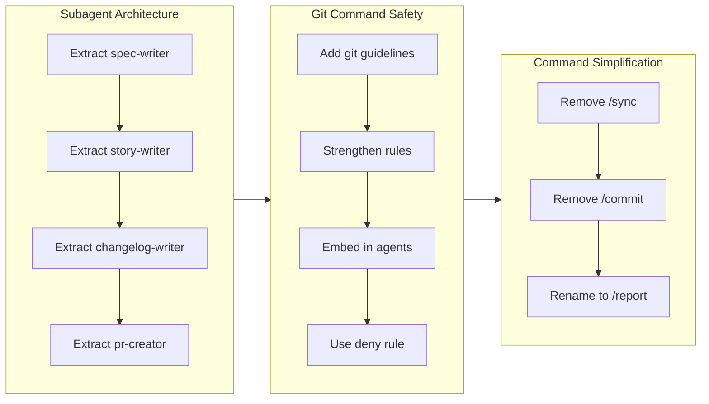

# Write Story

Generate a branch story that serves as the single source of truth for PR content.

## Calculate Metrics

Run the bundled script to calculate performance metrics:

```bash
bash .claude/skills/write-story/sh/calculate.sh [base-branch]
```

Default base branch is `main`.

### Output Format (JSON)

```json
{
  "commits": 15,
  "started_at": "2026-01-15T10:30:00+09:00",
  "ended_at": "2026-01-15T14:45:00+09:00",
  "duration_hours": 4.25,
  "duration_days": 1,
  "velocity": 3.53,
  "velocity_unit": "hour"
}
```

### Velocity Unit Selection

- `duration_hours < 8`: velocity is commits/hour, unit is "hour"
- `duration_hours >= 8`: velocity is commits/day, unit is "day"

Business days are more meaningful for multi-day work since developers have breaks between sessions.

## Story Content Structure

The story content (this IS the PR description):

```markdown
## 1. Overview

[2-3 sentence overview capturing the essence of this branch. What was the main goal? What approach was taken? What was achieved? Write in past tense.]

**Highlights:**

1. First meaningful change (from CHANGELOG entry titles)
2. Second meaningful change (from CHANGELOG entry titles)
3. ...

## 2. Motivation

[Why this work started. 40-60 words max. Synthesize ticket Overviews into a single paragraph.]

## 3. Journey



**Flowchart Guidelines:**
- Use `flowchart LR` for horizontal timeline (subgraphs arranged left-to-right)
- Use `direction TB` inside each subgraph for vertical item flow
- Group by theme: each subgraph represents one concern or decision area
- Connect subgraphs in timeline order to show work progression
- Use descriptive node labels: `id[Description]` syntax
- Maximum 3-5 subgraphs per diagram

[Brief summary (50-100 words). Let the flowchart carry detail; the prose provides high-level overview only.]

## 4. Changes

One subsection per ticket, in chronological order:

### 4.1. <Ticket title> ([hash](https://github.com/qmu/workaholic/commit/hash))

Brief 1-2 sentence description from ticket Overview.

### 4.2. <Next ticket title> ([hash](https://github.com/qmu/workaholic/commit/hash))

Brief 1-2 sentence description from ticket Overview.

### ...

**Changes Guidelines:**
- One subsection per ticket (not grouped by theme)
- Format: `### 4.N. <Title> ([hash](https://github.com/qmu/workaholic/commit/hash))` - link to GitHub commit
- Content: 1-2 sentences from ticket Overview
- Chronological order matches ticket creation time

## 5. Outcome

[What was achieved. 40-60 words max. Focus on key accomplishments, not exhaustive listing.]

## 6. Historical Analysis

[Related past work context. 30-50 words max. Or "No related historical context." if none.]

## 7. Concerns

[Risks or trade-offs. 30-50 words max per concern. Or "None" if nothing to report.]

## 8. Ideas

[Future enhancement suggestions. 30-50 words max. Bullet list preferred. Or "None" if nothing.]

## 9. Performance

**Metrics**: <commits> commits over <duration> <unit> (<velocity> commits/<unit>)

### 9.1. Pace Analysis

[Quantitative reflection on velocity. 30-50 words max. State pattern (steady/varied), commit size observation, notable timing.]

### 9.2. Decision Review

| Dimension      | Rating                            | Notes             |
| -------------- | --------------------------------- | ----------------- |
| Consistency    | Strong/Adequate/Needs Improvement | Brief observation |
| Intuitivity    | ...                               | ...               |
| Describability | ...                               | ...               |
| Agility        | ...                               | ...               |
| Density        | ...                               | ...               |

**Strengths**: [Key positive patterns observed]

**Areas for Improvement**: [Constructive suggestions]
```

**Performance-analyst input:**

The performance-analyst markdown is provided by the orchestrator (`/story` command) which invokes performance-analyst as a parallel agent. Include the complete output in section 9.2.

```markdown
## 10. Release Preparation

**Verdict**: [Ready for release / Needs attention before release]

### 10.1. Concerns

- [List any concerns from release-readiness analysis]
- Or "None - changes are safe for release"

### 10.2. Pre-release Instructions

- [Steps to take before running /release]
- Or "None - standard release process applies"

### 10.3. Post-release Instructions

- [Steps to take after release]
- Or "None - no special post-release actions needed"
```

**Release-readiness input:**

The release-readiness JSON is provided by the orchestrator (`/story` command) which invokes release-readiness as a parallel agent. The JSON contains:

```json
{
  "releasable": true/false,
  "verdict": "Ready for release" / "Needs attention before release",
  "concerns": [],
  "instructions": {
    "pre_release": [],
    "post_release": []
  }
}
```

Format this JSON into section 10.

```markdown
## 11. Notes

[Additional context. 30-50 words max. Or omit section if nothing relevant.]
```

## Story Frontmatter

Create `.workaholic/stories/<branch-name>.md` with YAML frontmatter:

```yaml
---
branch: <branch-name>
started_at: <from metrics.started_at>
ended_at: <from metrics.ended_at>
tickets_completed: <count of tickets>
commits: <from metrics.commits>
duration_hours: <from metrics.duration_hours>
duration_days: <from metrics.duration_days if velocity_unit is "day">
velocity: <from metrics.velocity>
velocity_unit: <from metrics.velocity_unit>
---
```

## Writing Guidelines

- Write in third person ("The developer discovered..." not "I discovered...")
- Connect tickets into a narrative arc, not a list
- Highlight decision points and trade-offs
- **Section length targets:**
  - Motivation/Outcome: 40-60 words
  - Journey prose: 50-100 words (let flowchart carry detail)
  - Historical Analysis/Concerns/Ideas/Pace Analysis/Notes: 30-50 words each
  - Changes section: detailed (no limit, one entry per ticket)
- Historical Analysis/Concerns/Ideas can be "None" if empty

## Updating Stories Index

Update both `.workaholic/stories/README.md` and `README_ja.md` to include the new story:

**README.md**:
- Add entry: `- [<branch-name>.md](<branch-name>.md) - Brief description of the branch work`

**README_ja.md**:
- Add entry: `- [<branch-name>_ja.md](<branch-name>_ja.md) - ブランチの作業内容の簡潔な説明`

## Translation

Per `.workaholic/` i18n requirements, create a Japanese translation alongside the English story:

1. Create `<branch-name>_ja.md` with translated content
2. Keep frontmatter in English (only translate prose content)
3. Follow the preloaded `translate` skill for translation policies
4. Technical terms (commit, branch, plugin, etc.) should remain in English
