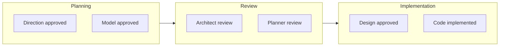

# Write Trip Report

Generate a development journey report from a trip session's artifacts using the unified report format.

## Gather Artifacts

```bash
bash ${CLAUDE_PLUGIN_ROOT}/skills/write-trip-report/scripts/gather-artifacts.sh <trip-name>
```

Parse JSON output for artifact paths. Read each artifact to extract summaries.

## Report Structure

The report uses the same 9-section structure as drive reports. Trip artifacts are mapped to sections as described below. The report file is written to `.workaholic/stories/<branch-name>.md` with YAML frontmatter.

### Story Frontmatter

```yaml
---
branch: <branch-name>
tickets_completed: 0
---
```

### Artifact-to-Section Mapping

| Section | Source Artifact | Extraction |
| ------- | -------------- | ---------- |
| 1. Overview | direction | Goals, scope, key decisions → 2-3 sentence summary with highlights |
| 2. Motivation | direction | Stakeholder needs, the "why" behind the trip |
| 3. Changes | design, git log | Mermaid flowchart of trip phases + implementation changes |
| 4. Outcome | reviews, test results | What was accomplished, key findings |
| 5. Historical Analysis | history.md | Related past work or "No related historical context." |
| 6. Concerns | reviews | Reviewer concerns, trade-offs identified |
| 7. Ideas | reviews | Enhancement suggestions, out-of-scope improvements |
| 8. Successful Development Patterns | reviews, artifacts | Effective patterns discovered during the trip |
| 9. Release Preparation | (default) | "Ready for release" unless artifacts indicate otherwise |
| 10. Notes | event-log.md | Trip Activity Log as collapsed details block |

### Template

```markdown
## 1. Overview

[Synthesize from direction artifact: 2-3 sentence summary capturing the trip's goals and scope.]

**Highlights:**

1. [Primary accomplishment or goal]
2. [Secondary accomplishment or goal]
3. [Third accomplishment or goal]

## 2. Motivation

[Derive from direction artifact: paragraph synthesizing the stakeholder needs and the "why" behind the trip.]

## 3. Changes



[Summary of the overall development journey from planning through implementation.]

### 3-1. <Phase or change description> ([hash](<repo-url>/commit/<hash>))

<1-3 sentence summary of what changed and why.>

### 3-2. <Next phase or change description> ([hash](<repo-url>/commit/<hash>))

<1-3 sentence summary of what changed and why.>

## 4. Outcome

[Summarize from reviews and test results: what was accomplished, key findings, pass/fail outcomes.]

## 5. Historical Analysis

[From history.md if available. If no related historical context exists, write "No related historical context."]

## 6. Concerns

[From review artifacts: risks, trade-offs, or issues raised during reviews.]

- <description> (from <reviewer> review)

Write "None" if nothing to report.

## 7. Ideas

[From review artifacts: enhancement suggestions, out-of-scope improvements identified.]

Write "None" if nothing to report.

## 8. Successful Development Patterns

[Effective patterns discovered during the trip that are worth preserving. Extract from review artifacts (approaches that worked well), design decisions that proved effective, and collaboration patterns between agents.]

Write "None" if no noteworthy patterns emerged.

## 9. Release Preparation

**Verdict**: Ready for release

### 9-1. Concerns

- None - changes are safe for release

### 9-2. Pre-release Instructions

- None - standard release process applies

### 9-3. Post-release Instructions

- None - no special post-release actions needed

## 10. Notes

[If event log is available, include Trip Activity Log here as a collapsed details block. Otherwise, additional context for reviewers.]
```

### Extracting Summaries

For each artifact (direction, model, design): read the latest approved version, extract the Content section, summarize in 3-5 sentences focusing on key decisions and outcomes.

For reviews: read all files in `reviews/` (both `round-<N>-<agent>.md` and `response-<author>-to-<reviewer>.md`), identify key concerns and resolutions. Map positive outcomes to section 4 (Outcome), concerns to section 6 (Concerns), and enhancement ideas to section 7 (Ideas).

### Changes Section

The Changes section uses subsections keyed to significant commits or implementation phases (not tickets, since trips do not use tickets):

- Use `git log --oneline --reverse <base-branch>..<trip-branch>` to identify significant commits
- Group related commits into phases (e.g., "Planning", "Model definition", "Implementation")
- Each subsection: `### 3-N. <Description> ([hash](<repo-url>/commit/<hash>))`
- Commit hash MUST be a clickable GitHub link
- Maximum 3-5 subgraphs in the Mermaid flowchart showing trip phases

### Historical Analysis Section

Priority order: (1) `history.md` contents summarized, (2) `plan.md` Progress section if `has_plan` is true, (3) "No related historical context."

### Notes Section (Trip Activity Log)

If `has_event_log` is true, read `event_log_path`. Include the Trip Activity Log as a collapsed details block:

```markdown
<details>
<summary>Trip Activity Log (N events)</summary>

[Full event log table]

</details>
```

For logs with 30 or fewer data rows, the table may be shown directly without collapsing. For larger logs, always use the collapsed block.

### Release Preparation Section

For trips, default to "Ready for release" with no concerns. If review artifacts contain explicit blocking concerns (security issues, failing tests, incomplete implementations), reflect those in the verdict and concerns list.

## Create PR

After writing the report, the PR is created by the report command using the `create-or-update.sh` script from the report skill. The PR title is derived from the first highlight in the Overview section.
